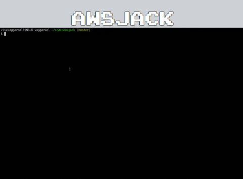

[](https://travis-ci.com/viveknangal/awsjack)


## AWSJack
AWSJack is a UI tool meant for AWS Cloud & being primarily developed from the perspective of the **Operations team** who is responsible for managing the AWS cloud infrastructure.  At times ,as infrastructure grows it becomes difficult to get a consolidated view of information like 
- How much we spend on an individual EC2 instance
- Which Ports are open to the world (0.0.0.0/0)
- Which all Groups,InlinePolicies, UserPolicies attached to IAM user
- Which all instances having  PublicIP attached
- How No. of EBS disks attached to an instance

And that where this tool comes handy! :blush:

## "AWSJack" API Docs
[pkg.go.dev](https://pkg.go.dev/github.com/viveknangal/awsjack@v0.2.0/utils?tab=doc)

## Demo


## Pre-requisite to run
1. First & foremost, this tool requires valid **AWS IAM credentials** to be configured on the machine in case you're running this application from a machine outside VPC (eg: laptop) and if running from an AWS EC2 node then **IAM role** will also work. Follow this [link](https://docs.aws.amazon.com/cli/latest/userguide/cli-configure-quickstart.html#cli-configure-quickstart-config) for configure IAM credentials if missing.
 1. **IAM Permissions** : This application requires only `read-only access`, specific  `IAM policy` details are provided below:- 
```
{
    "Version": "2012-10-17",
    "Statement": [
        {
            "Sid": "VisualEditor0",
            "Effect": "Allow",
            "Action": [
                "pricing:DescribeServices",
                "pricing:GetAttributeValues",
                "pricing:GetProducts",
                "ec2:DescribeInstances",
                "ec2:DescribeSecurityGroups",
                "iam:ListGroupsForUser",
                "iam:ListAttachedUserPolicies",
                "iam:ListUsers",
                "iam:ListUserPolicies",
                "iam:ListMFADevices",
            ],
            "Resource": "*"
        }
    ]
}
```

3. Docker need to be installed.Follow this [link](https://docs.docker.com/get-docker/) for its installation incase its not installed.
 
## How to run


  **AWSJack** tool will using Docker & for that first download this repo then follow below steps:-


1. Build the Docker image using `docker build` command :
```
docker build -t awsjack:latest .
```
1. Then `docker run` command as below :-
```
docker run -v ~/.aws:/root/.aws -p 8080:8080 awsjack:latest "us-east-1,us-east-2"
```
- -v  =  This is required for mount the **.aws** directory which holds the AWS IAM credentials. This is not required if running from a machine in AWS which has IAM role attached
- -p  = Exposing the port 8080 on the local machine,on this port we'll access the UI screen
- awsjack:latest  = This is the Docker image we created above

- "eu-west-1,us-east-2"  = Pass the AWS regions in comma separated format , this input is required for view the details of those specific AWS regions on the **awsjack** UI.

3. Once the above docker instance is up & running, access the application in the browser using below endpoint 
```
     http://localhost:8080/
```     
## License
Licensed under the [MIT License](LICENSE)
